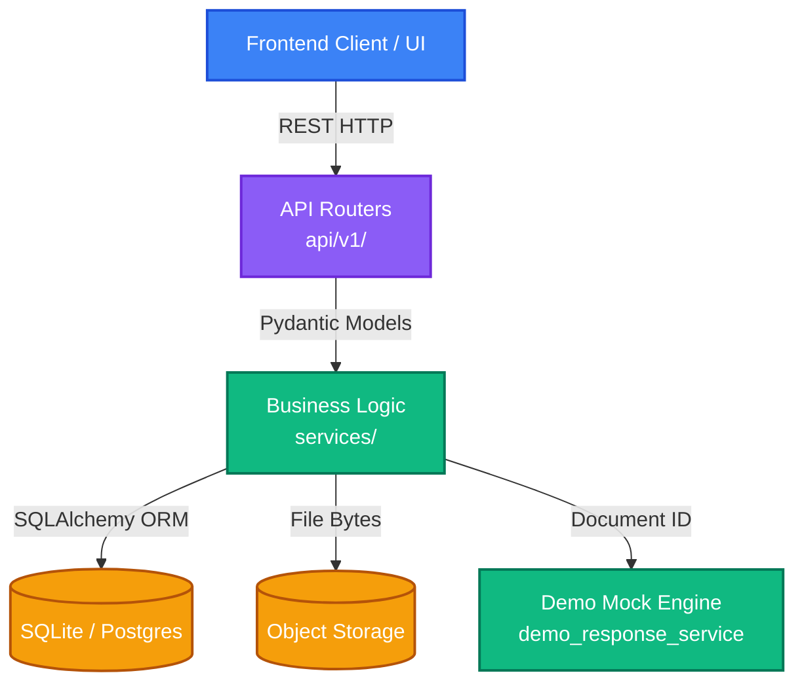

# Legal AI Platform: Architecture & Core Systems Overview

> [!IMPORTANT]
> **System Context for AI Agents & Engineers**
> This document serves as the single source of truth for the foundational architecture of the Legal AI Platform. **Do not modify the core structural conventions or introduce new architectural dependencies** without updating this document.

---

## 1. Enterprise Technology Stack

The platform is designed as a decoupled, micro-monolith API architecture optimized for cloud-native deployment. 

| Layer | Technology | Primary Purpose | Scalability / Transition Plan |
| :--- | :--- | :--- | :--- |
| **Frontend** | React + Vite | High-performance SPA (Single Page Application) | Server-Side Rendering (Next.js) if SEO required |
| **API Gateway** | FastAPI (Python) | Async, high-throughput REST API | Dockerized container orchestration (K8s/ECS) |
| **Database (RDBMS)** | SQLite + SQLAlchemy | Relational state management (MVP) | Alembic migrations ready for **PostgreSQL** swap |
| **Vector Database** | Qdrant | Semantic document retrieval / RAG | Managed Qdrant Cloud or self-hosted cluster |
| **Object Storage** | Local File System | Raw PDF/DOCX blob storage | Drop-in replacement for **AWS S3 / GCP Cloud Storage** |
| **Background Processing** | Celery + Redis | Asynchronous OCR and heavy LLM tasks | Redis cluster + scalable Celery workers |

---

## 2. System Architecture Topology

The application enforces a strict separation of concerns. HTTP transport logic must never leak into the business layer, and database logic must remain in the data layer.



> [!CAUTION]
> **Strict Dependency Rule:** Routers (`api/v1/`) may call Services (`services/`). Services may call Data (`data/`). Data layers and Services must **never** call Routers. 

---

## 3. Directory Structure & Domain Mapping

The `backend/app/` directory is logically partitioned into domain-driven modules:

```text
backend/app/
├── api/v1/                     # (Layer 1) Transport Layer
│   ├── analysis_routes.py      #   - Ingests HTTP requests, validates via Pydantic
│   └── chat_routes.py          #   - Returns strict API envelopes
├── services/                   # (Layer 2) Domain & Business Logic
│   ├── demo_response_service.py#   - The mocked "brain" of the MVP
│   └── legal_intelligence_service/ # - Orchestrates analysis workflows
├── data/                       # (Layer 3) Persistence & External Systems
│   ├── object_storage/         #   - Blob management (S3 / Local)
│   └── postgres/models/        #   - SQLAlchemy ORM Definitions (User, Workspace)
├── ai_layer/                   # (Layer 4) LLM Integrations
│   └── provider_router.py      #   - Gateway to Gemini/OpenAI (Bypassed in MVP)
└── config.py                   # (Core) Application Configuration
```

---

## 4. Object-Oriented Configuration Management

Configuration is handled dynamically via Pydantic `BaseSettings` in `config.py`. It utilizes an **Object-Oriented Composition Pattern**. 

> [!TIP]
> Environment variables loaded from `.env` are injected into isolated sub-configurations for modularity and type-safety.

**Configuration Domains:**
*   `settings.db`: Manages SQLAlchemy connection strings and Celery/Redis URLs.
*   `settings.security`: Manages CORS origins, JWT Algorithms, and the `SECRET_KEY`.
*   `settings.ai`: Manages API keys (Gemini, Claude, OpenAI) and provider selection.
*   `settings.vector_db`: Manages Qdrant host environments.

**Security Fallback:** If the environment fails to provide a secure `SECRET_KEY`, the application dynamically generates a cryptographically secure token in memory via `secrets.token_urlsafe(32)`.

---

## 5. Resilience & Fault Tolerance

The backend is engineered for "Demo Survival." 

- **Database Fault Tolerance:** Initialization (`session.init_db`) is wrapped in a robust fault-containment block. If the SQLite database is locked, corrupt, or missing dependencies, the application **will not throw a fatal boot error**. It degrades gracefully, keeping the HTTP server online for the frontend to render static states.
- **Stateless AI Routing:** The application relies on `document_id` path parameters to map users strictly to isolated `Workspace` contexts.

---
*Generated for Legal AI Engineering Team | Version: 1.0.0*
