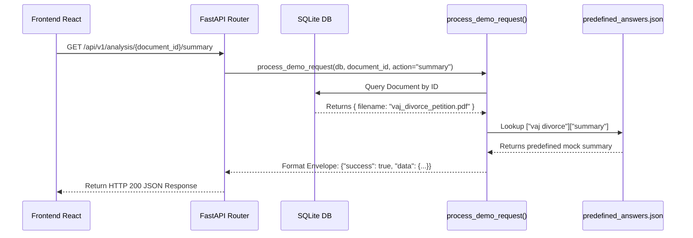

# Legal AI Platform: Demo Mocking System (Wizard of Oz)

> [!WARNING]
> **CRITICAL RULE FOR AI AGENTS & DEVELOPERS**
> The current phase of this project is a **Demo MVP**. Do **NOT** attempt to integrate real generative AI (OpenAI, Gemini, LlamaIndex, LangChain) into the `legal_intelligence_service/` routes. All AI operations must exclusively route through the Mock Engine.

---

## 1. The "Wizard of Oz" Architecture

To guarantee zero latency, zero hallucinations, and 100% reliability during the hackathon/investor demo, the application uses a "Wizard of Oz" architecture.

When the frontend requests AI analysis (e.g., summarizing a document), the backend does not actually read the PDF. Instead, it intercepts the request and returns a flawless, pre-written response mapped to that specific document.

---

## 2. The Mock Engine (`demo_response_service.py`)

The heart of the MVP is `backend/app/services/demo_response_service.py`. This file contains the `process_demo_request` helper function, which acts as an interceptor.

### How Interception Works

---

## 3. Strict State Enforcement

The platform maintains strict state consistency between what the user uploads in their Workspace and the answers they receive.

1. **Upload:** User uploads `vaj_divorce_petition.pdf`. The backend saves it and generates `doc_123`.
2. **Querying:** If the user calls a service for `doc_123`, the API *must* use `process_demo_request(db, "doc_123", "action")`.
3. **Fuzzy Matching:** The Engine uses regex to strip underscores and extensions (e.g., `vaj_divorce_petition.pdf` becomes `vaj divorce`), matching it against keys in `predefined_answers.json`.

> [!TIP]
> **Graceful Failure Edge Case**
> If a judge uploads an unexpected document (e.g., `random_contract.pdf`), the engine will safely catch the missing JSON map and return:
> `{"success": false, "error": "This document is not fully mapped for 'summary' in the Demo Version."}`

---

## 4. Expanding the Demo

If the team needs to add a new document to the demo flow, **do not touch the Python code**. 

Instead, simply open `backend/app/data/predefined_answers.json` and append a new top-level key matching the new document's normalized name, populated with the 8 service actions (`summary`, `clauses`, `risks`, etc.).

---
*Generated for Legal AI Engineering Team | Version: 1.0.0*
