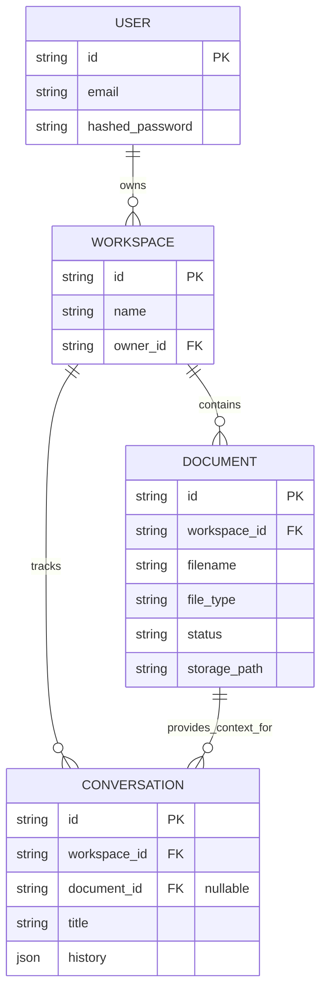

# Legal AI Platform: Database Schema & Entity Relationships

> [!IMPORTANT]
> **Data Integrity Rule**
> The backend relies exclusively on `document_id` to maintain contextual state. Never build an AI route that accepts a naked `filename` or `text` payload without associating it to a `document_id` scoped to the current `workspace_id`.

---

## 1. Entity Relationship Diagram (ERD)

The platform utilizes a hierarchical isolation model. A `Workspace` isolates data for a team/project. A `Document` isolates the legal context. A `Conversation` tracks user interactions regarding that context.

---

## 2. Core Entity Summaries

### `User`
Manages authentication. Currently bypassed via the mock user `mock-user-id` generated in `init_db()` for the MVP.

### `Workspace`
The primary boundary for data access. All queries fetching `Documents` must ideally enforce a `workspace_id` check (often managed automatically by the `get_current_workspace` dependency in FastAPI).

### `Document`
The critical anchor for the Demo MVP. 
- `filename`: The original string (e.g., `vaj_divorce_petition.pdf`). The Mock Engine (`demo_response_service`) uses this exact string to fuzzy match against `predefined_answers.json`.
- `storage_path`: The physical location of the raw PDF in the `backend/storage_data` object storage directory.
- `status`: For the MVP, this is instantly forced to `"ready"` upon upload to skip Celery OCR pipelines.

### `Conversation`
Stores chat history for Service 6 (Document Q&A). It can optionally be bound to a specific `document_id` if the user is asking questions about a specific PDF, or it can be unbound if they are asking general Indian Legal Q&A.

---
*Generated for Legal AI Engineering Team | Version: 1.0.0*
